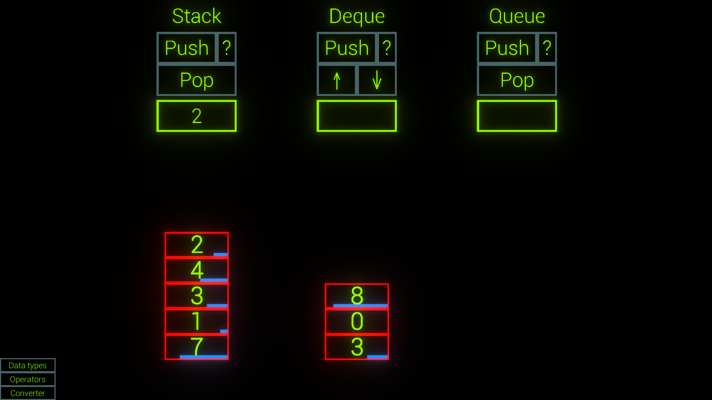
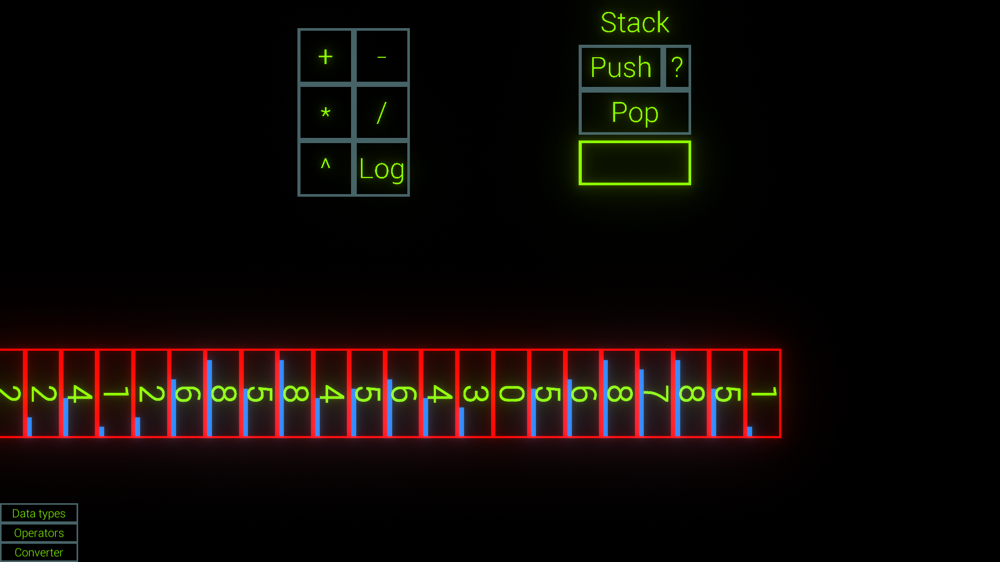
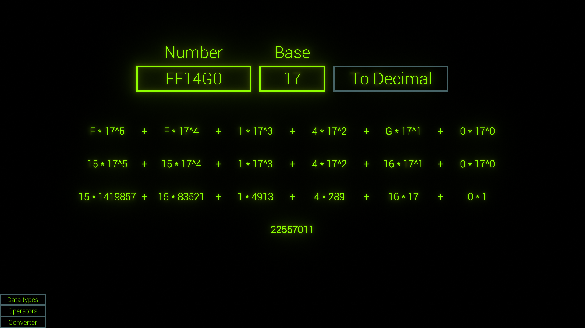

# Unnamed project about simple data structures and number base conversion

A project I made during my first year in university.

Shows how stack, deque, and queue work (not really).
Also shows the process of converting a number from base N to decimal, step by step.

## Features
The project is fully complete and well polished:
- Impossible to break:
  - All exceptional conditions are handled
  - Multiple consecutive actions never break animations
  - Input validation
  - Intuitive (and elegant) "missing input" hints
- Text input with modes for single digit numbers, max value cap with clamping to edge, and more
- No ugly input cursors
- Scene transition effect

## Screenshots

